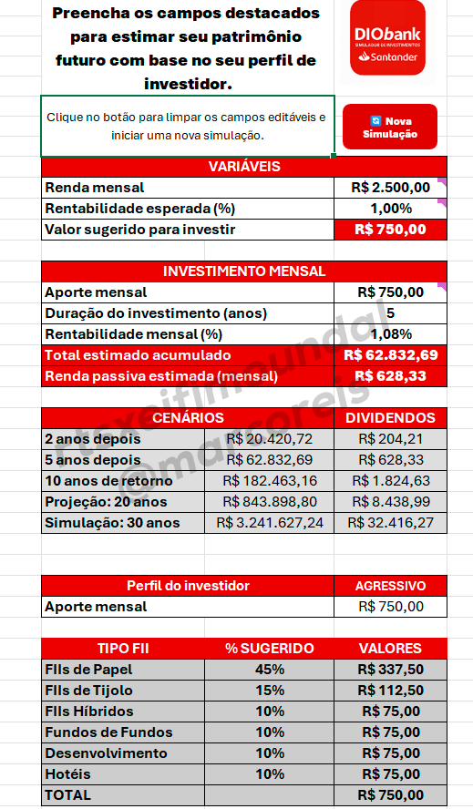

## 📸 Imagens do Projeto

### 📊 Simulação final

---

## 🧾 Como usar

1. Preencha os campos destacados: renda, aporte, tempo, rentabilidade
2. Escolha o perfil de investidor
3. Veja os valores calculados automaticamente
4. Clique em "🔄 Nova Simulação" para reiniciar

---

## 👨‍💻 Autor

**Marco Reis**  
Projeto criado exclusivamente para o bootcamp da DIO.  
Todos os direitos reservados ao autor.

---

## 📎 Licença

Este projeto é educativo. Proibida a cópia, redistribuição ou comercialização sem autorização do autor.

